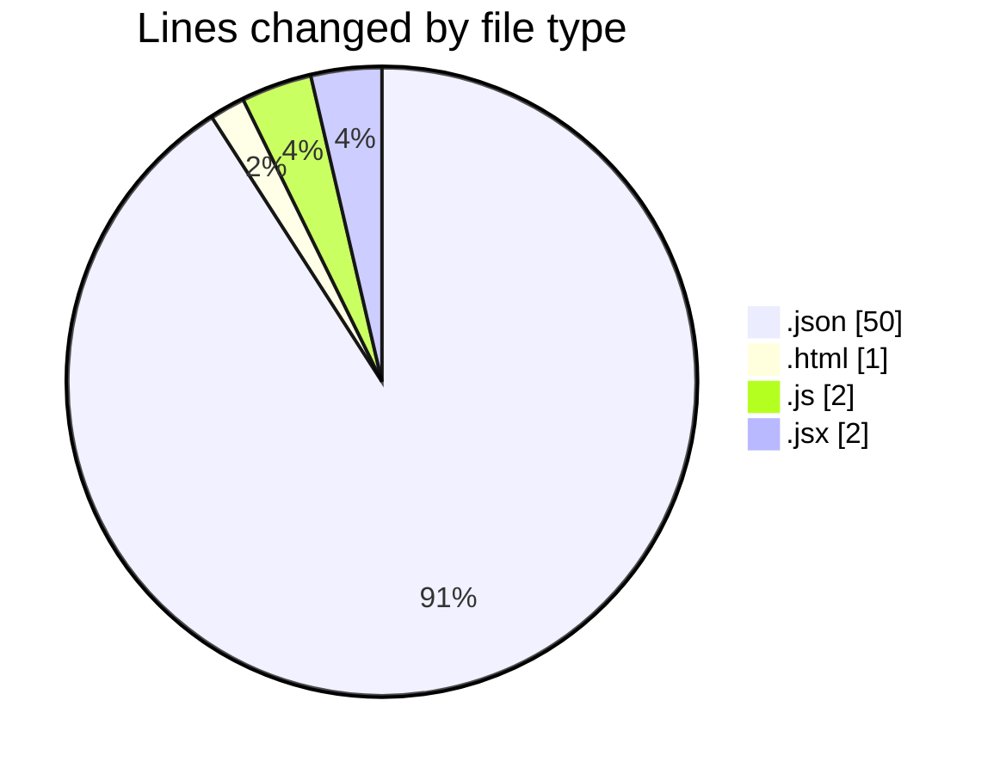
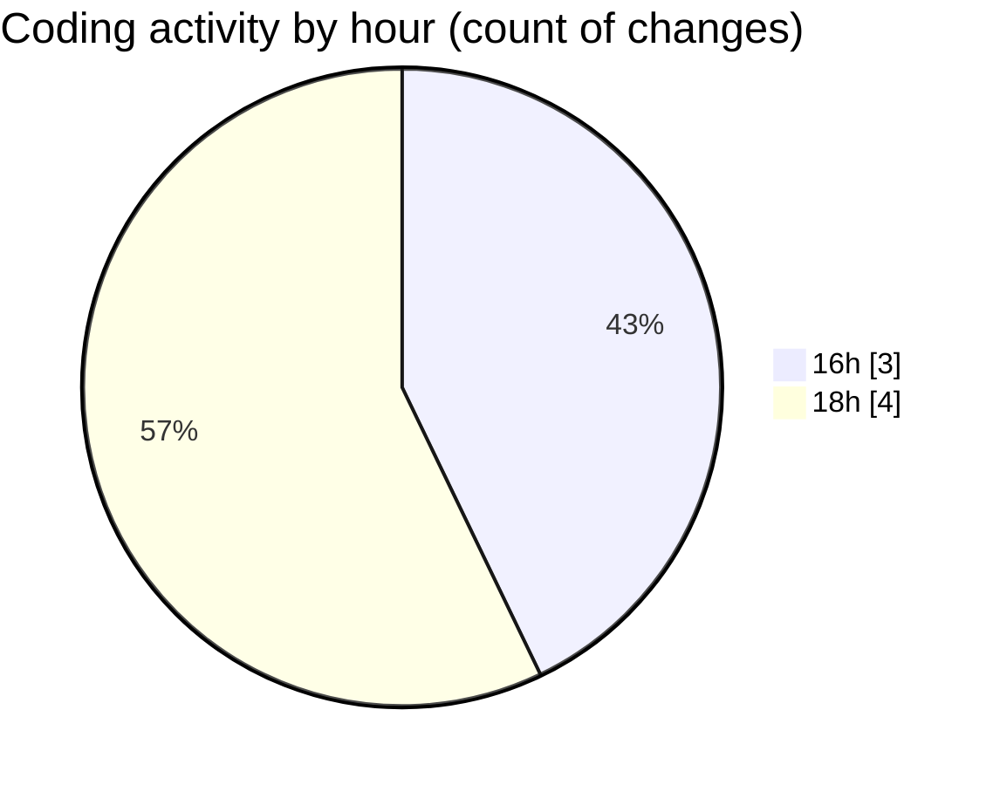

# multipages pages - Activity Summary 

## Overall Statistics

| Stat                   | Value                                                             |
| ---------------------- | ----------------------------------------------------------------- |
| **Lines Added** (➕)   | 55                                          |
| **Lines Removed** (➖) | 0                                        |
| **Net Change** (↕)    | 55                |
| **Active Time** (⌚)   | 7 minutes |

## Modified Files
- **settings.json** (+49, -0)
- **index.html** (+1, -0)
- **package.json** (+1, -0)
- **tailwind.config.js** (+1, -0)
- **postcss.confog.js** (+1, -0)
- **main.jsx** (+1, -0)
- **app.jsx** (+1, -0)

## Visualizations

### By File Type (Lines Changed)

### By Hour (Estimated Activity Count)

> **Last Updated:** 9/2/2025, 6:47:32 PM