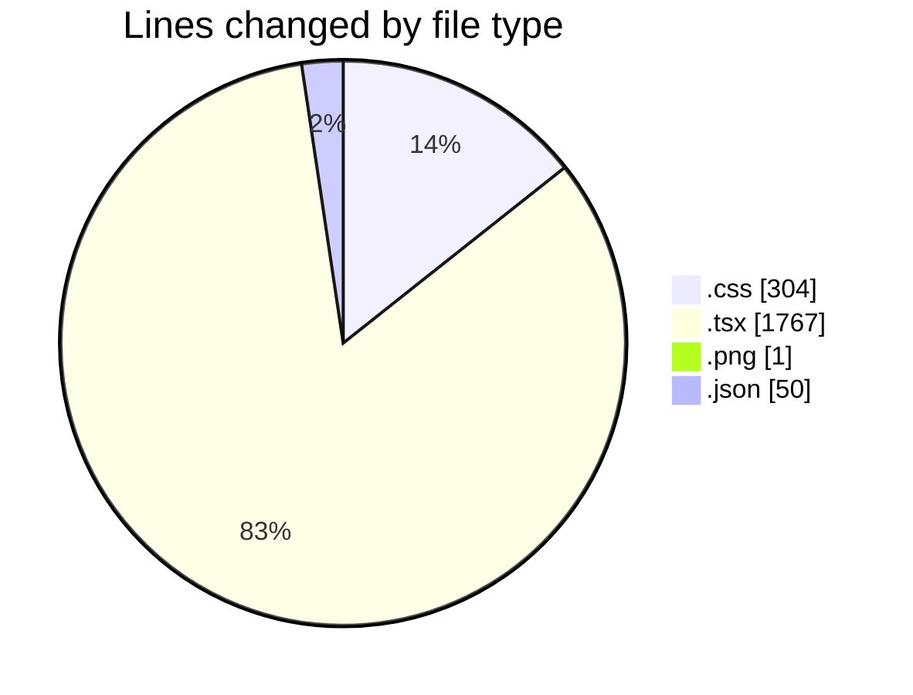
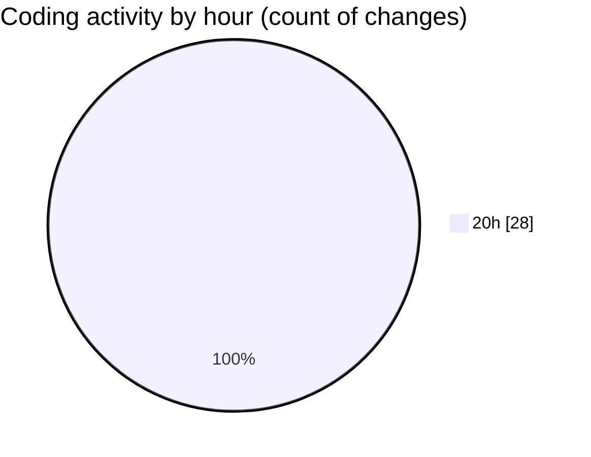

# DEEP - Activity Summary 

## Overall Statistics

| Stat                   | Value                                                             |
| ---------------------- | ----------------------------------------------------------------- |
| **Lines Added** (➕)   | 2122                                          |
| **Lines Removed** (➖) | 0                                        |
| **Net Change** (↕)    | 2122                |
| **Active Time** (⌚)   | 30 minutes |

## Modified Files
- **globala.css** (+304, -0)
- **layout.tsx** (+39, -0)
- **page.tsx** (+147, -0)
- **auth-dialog.tsx** (+297, -0)
- **community-sidebar.tsx** (+151, -0)
- **create-poste.tsx** (+104, -0)
- **navigation.tsx** (+276, -0)
- **post-card.tsx** (+119, -0)
- **settings-panel.tsx** (+305, -0)
- **starfield-background.tsx** (+27, -0)
- **user-menu.tsx** (+117, -0)
- **auth-context.tsx** (+131, -0)
- **theme-context.tsx** (+54, -0)
- **community-meeting.png** (+1, -0)
- **settings.json** (+50, -0)

## Visualizations

### By File Type (Lines Changed)

### By Hour (Estimated Activity Count)

> **Last Updated:** 9/3/2025, 8:47:57 PM