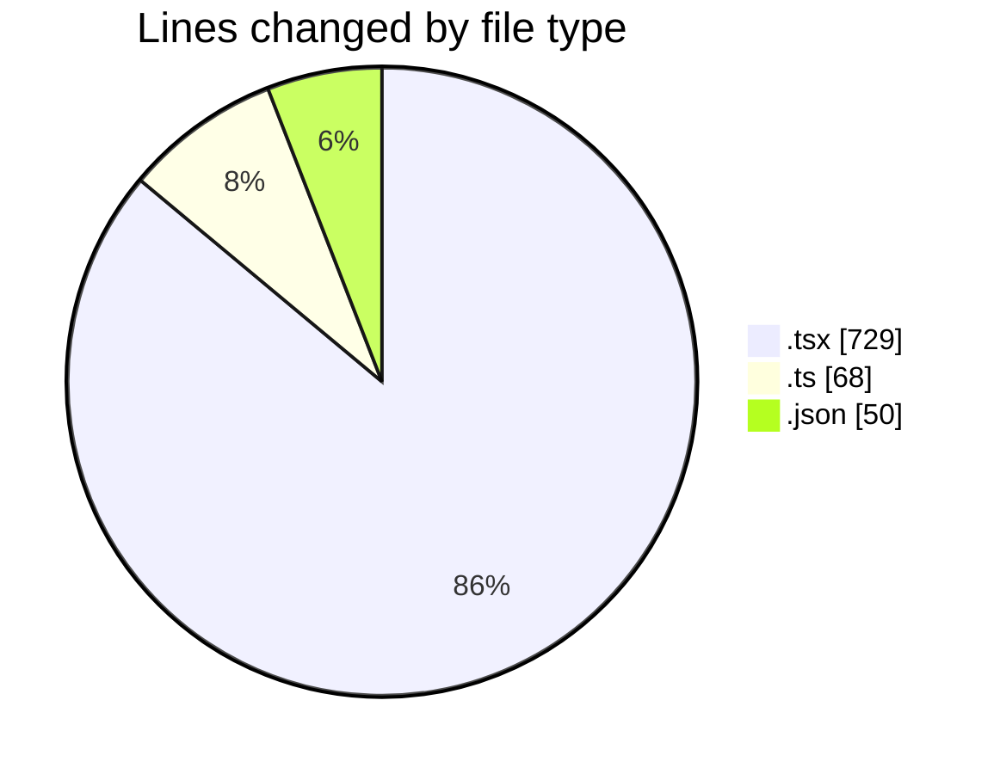
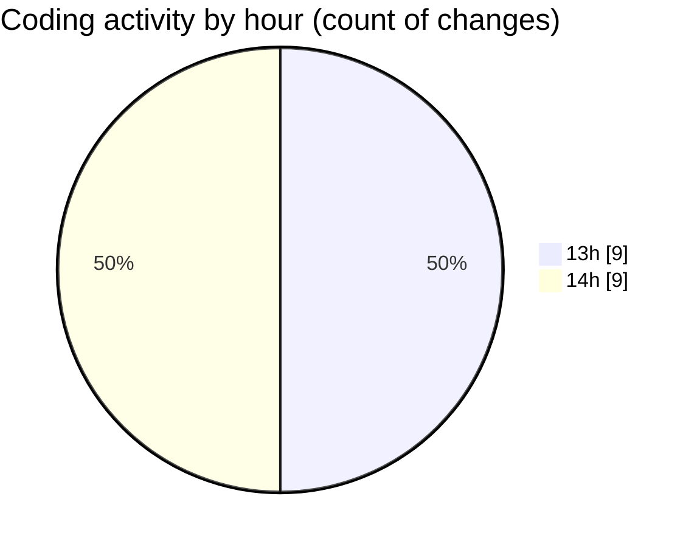

# E mail - Activity Summary 

## Overall Statistics

| Stat                   | Value                                                             |
| ---------------------- | ----------------------------------------------------------------- |
| **Lines Added** (➕)   | 844                                          |
| **Lines Removed** (➖) | 3                                        |
| **Net Change** (↕)    | 841                |
| **Active Time** (⌚)   | 17 minutes |

## Modified Files
- **App.tsx** (+474, -0)
- **layout.tsx** (+61, -0)
- **ResultDisplay.tsx** (+191, -3)
- **geminiService.ts** (+61, -0)
- **tsconfig.json** (+27, -0)
- **vite.config.ts** (+7, -0)
- **package.json** (+23, -0)

## Visualizations

### By File Type (Lines Changed)

### By Hour (Estimated Activity Count)

> **Last Updated:** 1/18/2026, 2:05:13 PM